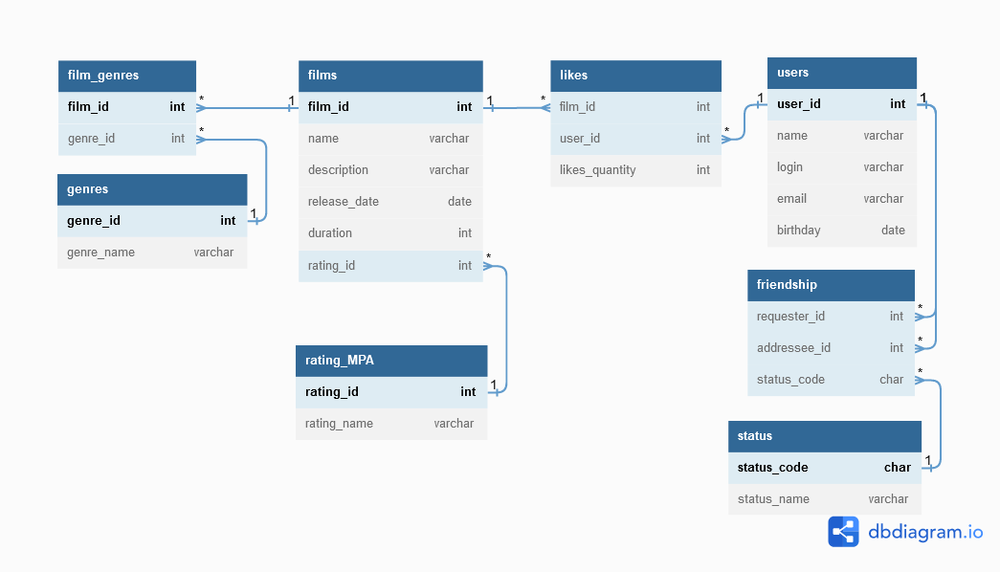

# java-filmorate

## Спринт № 11

### Промежуточное задание месяца SQL

Примеры запросов:

_Получение списка всех пользователей_

SELECT *
FROM users;

_Получение пользователя по id_

SELECT *
FROM users
WHERE user_id=1;

_Получение списка всех фильмов_

SELECT *
FROM films;

_Получение фильма по id_

SELECT *
FROM films
WHERE film_id=1;
  

