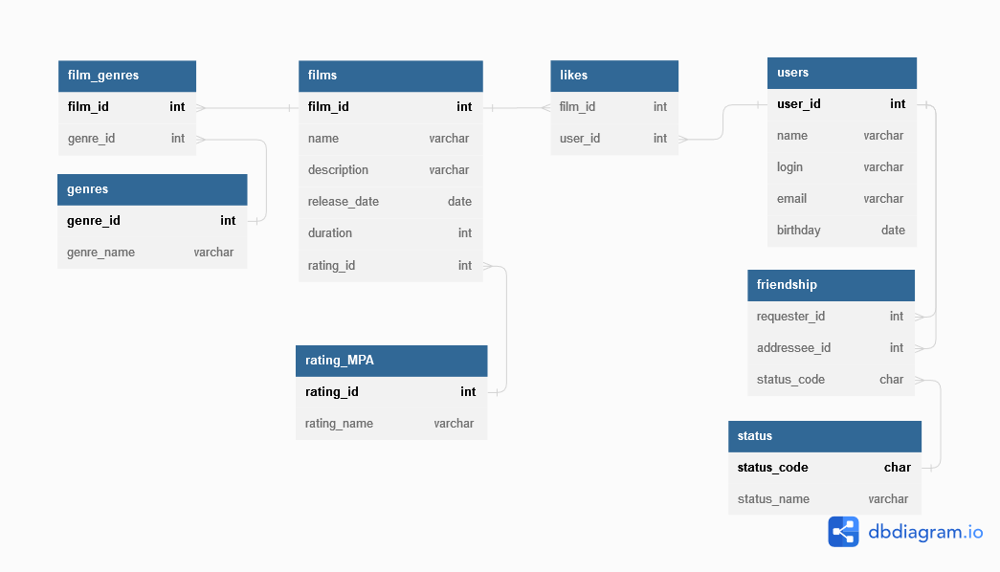

# java-filmorate
## Спринт № 11
### Промежуточное задание месяца SQL

Примеры запросов:
    
  
1. _Получение списка всех пользователей:_  
SELECT *  
FROM users  
2. _Получение пользователя по id = 1:_  
SELECT *  
FROM users  
WHERE user_id=1  
3. _Получение списка всех фильмов:_  
SELECT *  
FROM films  
4. _Получение фильма по id =1:_  
SELECT *  
FROM films  
WHERE film_id=1
5. _Вывести название фильмов у которых жанр = "Ужасы"_  
SELECT f.name,  
       g.genre_name  
FROM films AS f  
LEFT JOIN film_genres AS fg ON fg.film_id = f.film_id  
LEFT JOIN genres AS g on fg.genre_id = g.genre_id  
WHERE genre_name = 'Ужасы'  
  
  

